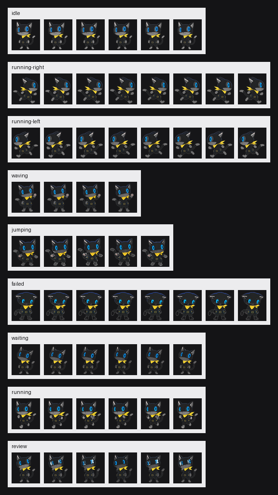

# Morgana Codex Pet

<p align="center">
  
</p>

<p align="center">
  《女神异闻录 5》摩尔加纳主题的 Codex 动态桌宠。
</p>

<p align="center">
  
  
  
</p>

本项目提供一套可直接安装的 Morgana 桌宠包，以及从关键帧生成动画、制作精灵图、验证和安装的完整流水线。桌宠会根据 Codex 的待机、执行、等待、审查和失败等状态切换动画。

> [!NOTE]
> 这是个人非商业同人项目，与 ATLUS、SEGA 或 OpenAI 无隶属或官方合作关系。

## 功能亮点

- 9 种 Codex 工作状态动画，覆盖待机、跑动、挥手、跳跃、失败、等待、执行和审查。
- 已构建可直接安装的 Codex v1 桌宠包。
- 从 A/B 关键帧确定性生成循环动画，结果可复现。
- 支持 MP4、MOV、WebM、MKV 或 PNG 序列作为动画输入。
- 自动抠除白底、缩放居中、生成透明精灵图和 QA 预览。
- 自动验证尺寸、透明度、安全边距、循环运动和左右跑镜像一致性。

## 快速安装

### 环境要求

- Windows 10/11
- 已安装支持自定义桌宠的 Codex 桌面客户端
- PowerShell 5.1 或更高版本

### 安装预构建版本

```powershell
git clone https://github.com/qzq2006/morgana-codex-pet.git
cd morgana-codex-pet
powershell -ExecutionPolicy Bypass -File tools/install_codex_pet.ps1
```

安装脚本会先检查 `package/pet.json` 和精灵图尺寸，再将以下文件复制到：

```text
%USERPROFILE%\.codex\pets\morgana
├── pet.json
└── spritesheet.png
```

安装完成后：

1. 完全退出并重新启动 Codex。
2. 打开“设置 → 个性化 → 桌宠”。
3. 选择 **Morgana**。

## 动画状态

精灵图采用 8 列 × 9 行布局，每个单元格为 192 × 208 像素。未使用的单元格保持完全透明。

| 行 | 状态 | 用途 | 帧数 |
|---:|---|---|---:|
| 0 | `idle` | Codex 待机 | 6 |
| 1 | `running-right` | 向右移动 | 8 |
| 2 | `running-left` | 向左移动，由右跑精确镜像生成 | 8 |
| 3 | `waving` | 挥手 | 4 |
| 4 | `jumping` | 跳跃或悬停反馈 | 5 |
| 5 | `failed` | 任务失败 | 8 |
| 6 | `waiting` | 等待用户输入或确认 | 6 |
| 7 | `running` | Codex 正在执行任务 | 6 |
| 8 | `review` | 审查或整理结果 | 6 |

最终包由以下两个文件组成：

```text
package/
├── pet.json          # 桌宠清单
└── spritesheet.png   # 1536 × 1872 RGBA 精灵图
```

## 从源码重建

### 1. 准备 Python 环境

建议使用 Python 3.10 或更高版本。

```powershell
py -m venv .venv
.\.venv\Scripts\Activate.ps1
python -m pip install --upgrade pip
python -m pip install pillow numpy opencv-python
```

### 2. 生成循环动画

仓库中的 `source-frames/` 包含 8 种动画的 A/B 关键帧。运行：

```powershell
python tools/synthesize_tween_animations.py
```

脚本使用双向 DIS 光流和余弦时间曲线，为每种状态生成 24 帧 A → B → A 循环，并写入 `videos/<状态>/`。

### 3. 生成动画行和桌宠包

```powershell
python tools/process_animations.py
```

该步骤会：

1. 为每种状态均匀抽取所需帧数。
2. 从 `running-right` 精确镜像生成 `running-left`。
3. 在 `qa/animations/` 生成 contact sheet 和 GIF。
4. 抠除白底并将角色放入 192 × 208 单元格。
5. 生成 `package/spritesheet.png` 和 `package/pet.json`。

如果已经准备好 `rows/<状态>/frame-*.png`，也可以跳过前两步，直接构建：

```powershell
python tools/build_codex_sheet.py
```

### 4. 验证构建结果

```powershell
python tools/verify_package.py
```

验证通过时会输出 `PASS`，并更新 `qa/package-verification.json`。当前提交已通过以下检查：

- 所有必需单元格都包含可见像素并保留安全边距。
- 所有未使用单元格均为透明。
- 左跑动画是右跑动画的逐帧精确水平镜像。
- 每个状态的循环都包含可测量的帧间运动。

### 5. 安装

```powershell
powershell -ExecutionPolicy Bypass -File tools/install_codex_pet.ps1
```

## 使用外部视频模型

除了内置的确定性光流方案，也可以使用支持首尾帧的视频模型生成动作：

1. 按照 [动画生产说明](VIDEO-PRODUCTION.md) 准备视频。
2. 将文件保存为 `videos/<状态>.mp4`，或将 PNG 序列放在 `videos/<状态>/`。
3. 运行 `python tools/process_animations.py`。
4. 检查 `qa/animations/` 下的 GIF 和 contact sheet。
5. 运行 `python tools/verify_package.py` 完成最终验证。

可接受的视频扩展名为 `.mp4`、`.mov`、`.webm` 和 `.mkv`。`running-left` 无需单独生成。

## 项目结构

```text
morgana-codex-pet/
├── package/               # 可直接安装的桌宠包
├── references/            # 角色视觉参考
├── source-frames/         # 各状态的 A/B 关键帧
├── videos/                # 光流帧、视频或外部 PNG 序列
├── rows/                  # 精灵图各状态的最终帧
├── qa/                    # contact sheet、GIF 和验证报告
├── tools/                 # 生成、加工、验证与安装脚本
├── codex-layout.json      # v1 图集布局和帧数定义
├── CODEX-INTEGRATION.md   # Codex 图集协议与集成说明
├── VIDEO-PRODUCTION.md    # 外部视频制作流程
└── provenance.json        # 素材和生成过程记录
```

主要脚本：

| 脚本 | 作用 |
|---|---|
| `tools/synthesize_tween_animations.py` | 从 A/B 关键帧生成可复现的光流循环 |
| `tools/process_animations.py` | 读取视频或 PNG 序列，抽帧、生成 QA 并构建包 |
| `tools/build_codex_sheet.py` | 从 `rows/` 拼装 v1 精灵图和清单 |
| `tools/verify_package.py` | 验证包结构、透明度、镜像和动画运动 |
| `tools/install_codex_pet.ps1` | 校验并安装到本机 Codex 桌宠目录 |

## 自定义角色或动画

要基于本项目制作自己的桌宠：

1. 替换 `source-frames/` 中相同命名的 A/B 图片，或提供对应视频。
2. 在 `package/pet.json.draft` 中修改 `displayName` 和 `description`。
3. 如需调整状态帧数或布局，修改 `codex-layout.json`，并同步检查构建与安装脚本中的尺寸约束。
4. 依次运行生成、加工和验证脚本。
5. 修改安装脚本中的目标目录名，避免覆盖现有 Morgana 桌宠。

角色应完整位于画面内，背景尽量使用纯白或透明色，并保持固定镜头，以获得更干净的透明边缘和更稳定的循环。

## 常见问题

### 安装后没有显示 Morgana

确认 `%USERPROFILE%\.codex\pets\morgana` 中同时存在 `pet.json` 和 `spritesheet.png`，然后完全重启 Codex，并在个性化设置中手动选择 Morgana。

### 提示 `Missing required frames`

检查 `rows/<状态>/` 中是否存在从 `frame-01.png` 开始的连续 PNG 文件，并确认数量满足上方状态表要求。

### 提示 `OpenCV is unavailable`

安装 OpenCV：

```powershell
python -m pip install opencv-python
```

也可以跳过视频解码，直接将逐帧 PNG 放入 `videos/<状态>/`。

### 角色边缘出现白边

构建器会将接近纯白的区域转换为透明度。输入素材应使用均匀纯白背景，避免白色高光或角色主体与背景颜色过于接近。

### Codex 更新后桌宠异常

本项目使用 Codex v1 精灵图格式。自定义桌宠协议目前未见于公开 OpenAI 文档，客户端升级后可能发生变化；请重新运行验证并参考 [Codex 集成说明](CODEX-INTEGRATION.md)。

## 质量与可追溯性

- 最终验证报告：[qa/package-verification.json](qa/package-verification.json)
- 全状态实际尺寸预览：[qa/final-contact.png](qa/final-contact.png)
- 动画 GIF 与逐状态接触表：`qa/animations/`
- 素材与生成记录：[provenance.json](provenance.json)

## 版权与使用说明

Morgana（摩尔加纳）及《Persona 5》相关角色、名称和商标归 ATLUS / SEGA 所有。视觉参考来自 [《Persona 5》官方摩尔加纳角色页](https://persona5.jp/sp/character/morgana.html)。本项目仅供个人、非商业的学习和桌宠使用。

本仓库当前未附带开源许可证。若要复制、修改、再发布或用于商业用途，请先确认代码许可及角色素材授权。

## 致谢

- ATLUS / SEGA：Morgana 与《Persona 5》原作。
- OpenAI Codex：桌宠运行环境。
- Pillow、NumPy 与 OpenCV：图像处理和动画生成。
